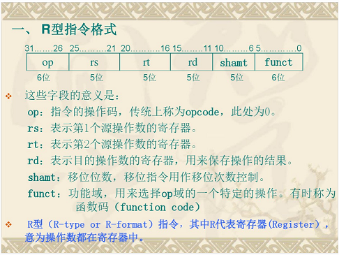
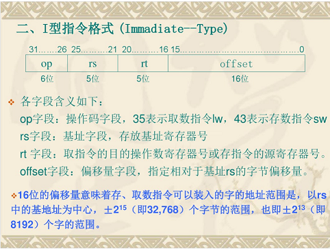
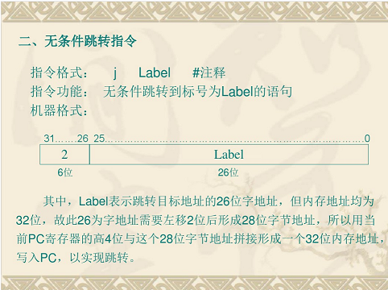

# 控制器

## 控制器的组成及指令的执行

### 基本的计算机组成和功能
计算机系统的基本组成主要包括三个部分:中央处理器(cpu)、存储器和I/O系统，它们之间都是通过总线连接的。从物理上来说，总线就是一组导线，起作用就是把信息从一个部件传到另一个部件。  
连接系统的总线包括三种信号：地址信号、数据信号和控制信号，传送这三种新号的总线分别称为地址总线AB、数据总线DB和控制总线CB。  
地址总线总是来自于CPU或总线主设备、数据总线的作用是在CPU、存储器和I/O设备之间传送数据  
计算机的主机包括运算器、控制器和主存三部分。运算器和控制器一起构成了CPU，它是整个计算机系统的核心。  
CPU具有以下四个方面的基本功能:1.指令控制，确保计算机指令按程序的顺序执行。2.操作控制，一条指令的功能通常由若干个操作信号组合起来实现，cpu控制这些微操作的产生、组合、传送和管理。3.时间控制，使各种微操作和指令的执行严格按照时间序列进行。4.数据加工，由运算器对数据进行算术运算和逻辑运算。

### 控制器的组成
1. 程序计数器PC  
程序计数器的功能是用来存放当前正在执行的指令地址或者下一条指令的地址。
2. 指令寄存器  
控制器从内存中取出指令，存放在指令寄存器IR中，以便控制器对指令进行译码、执行。
3. 指令译码器  
指令划分为操作码和地址码字段，为了执行指令寄存器中的指令，必须对操作码进行译码以识别该指令所要求的操作。
4. 操作控制信号形成部件  
根据指令操作码的译码信号以及时序信号，产生取出指令和执行这条指令所需的各种操作控制信号，以便正确地建立数据通路，完成取出指令和执行指令的控制。
5. 时序信号产生器
提供时钟信号和机器周期信号，以规定每个操作的时间。
6. 地址寄存器AR  
专门的收纳可能有多种来源的地址，然后统一在规定的节拍将地址送上总线的寄存器
7. 数据寄存器DR
当CPU把数据发送到存储器或I/O设备是，CPU一般会将数据送入DR，然后再从DR将数据送上数据总线。 

### 时序及控制方式
1. 时序信号
    1. 指令周期
    计算机取出一条指令并完成该指令的执行所需要的时间。
    2. 机器周期/CPU周期
    CPU与内存交换一次信息所需要的时间。
    3. 时钟周期/节拍周期
    一个CPU周期包含若干个时钟周期，是处理操作的最基本时间单位
一个机器周期需要多少个节拍最合适取决于该周期时间内需要顺序完成的基本操作步数，可采用下述方法确定：统一节拍法、分散节拍法、延长节拍法、时钟周期插入
2. 时序信号产生器
产生指令周期中各时序信号的逻辑电路，由时钟源、环形脉冲发生器、节拍脉冲逻辑、启停控制逻辑等部分构成
3. 控制方式
    1. 同步控制方式
    2. 异步控制方式
    3. 联合控制方式

## 数据通路和指令的执行过程

### 简单计算机系统的数据通路
- 存储器读操作
    1. 送地址到CPU片内总线，并送入地址寄存器AR
    2. 控制器放松存储器读信号，启动存储器读操作，并将读出的数据从数据总线上接收至数据寄存器DR
- 存储器写操作
    1. 送地址到CPU片内总线，并送入地址寄存器AR
    2. 送数据到DR，DR将数据送到数据总线，控制器发送存储器写信号，启动存储器写操作。

### 简单计算机系统主机各部件的实现方案
1. 运算器
2. 控制器
3. 存储器

### 简单计算机系统中指令的执行过程
1. 取指令
控制器先将第一条指令的地址置入程序计数器PC，PC将当前指令的地址送到地址寄存器AR，同时程序计数器PC的内容递增以指向下一条指令的地址，地址寄存器AR的输出通过地址总线送到存储器的地址端，指明指令所在的地址单元，控制器发出读控制信号，控制从存储器中读出这条指令；该指令通过数据总线送到指令寄存器IR。指令取到指令寄存器IR后，立即由指令译码器对其进行分析译码；指令译码器首先判断该指令是什么指令，然后将判断结果信息传递给操作控制信号形成部件。
2. 执行指令
操作控制信号形成部件根据指令译码信息和时序周期信号，发出该指令所需的所有不见的有一定时序关系的控制信号序列，完成指令的执行。

### MIPS单周期CPU的数据通路和指令的执行过程
1. 分析MIPS的指令格式，以及每种格式下指令的功能。
2. 根据指令功能，罗列所需器件和器件之间的连接方式。
3. 确定每个期间所需的控制信号。

单周期MIPS CPU要求在每个时钟周期执行一条指令。为保持在执行指令期间，指令存储器取出的指令不变，PC值在指令执行期间必须保持不变，因此PC+4的值应该在下个指令周期开始的时候付给PC。添加一个暂存PC自增值的寄存器PC_new，在指令周期clk的上升沿执行取指令操作，在clk的下降沿更新PC值。系统启动时PC复位，添加复位信号rst。

- R型指令数据通路的设计  
所有R型指令的共同特征是:操作码字段OP=000000b,指令的功能由功能码字段func指出。每条R型指令的操作数有3个，两个源操作数分别位于rs和rt字段所指定的寄存器中，而目的操作数则位于rd字段所制定的寄存器中。为实现R型指令，应添加多端口寄存器和多功能运算器。  
  - 32*32位寄存器堆和多功能运算器ALU建立数据通路，控制信号都由译码及控制单元发出，而译码及控制单元可以采用硬布线方式或微程序方式实现。  
  - rs->读端口A的寄存器地址，rt->读端口B的寄存器地址，rd->寄存器堆的写端口，寄存器AB口数据->ALU的输入端AB，ALU计算结果->寄存器堆的写数据端口  
  - OP字段全为0->R型指令->func字段翻译成ALU的控制信号ALU_OP
  - clk上升沿:启动指令存储器,依据PC读出指令
  - 在clk高电平持续期间:完成PC值的自增、指令译码、寄存器读操作、随后完成ALU运算
  - 在clk下降沿:完成目的寄存器的写入、PC值的更新和标志寄存器的更新
  - 将clk反相后作为寄存器堆、PC和标志寄存器的打入脉冲
  - add rd,rs,rt (算数加rs + rt -> rd)  
  clk的上升沿->启动指令存储器->依据PC读出add指令->clk高电平持续期间->PC_new寄存器=PC+4->指令译码->寄存器堆的读端口AB分别以指令的rs和rt作为寄存器号同时读寄存器->R_Data_A和R_Data_B分别输出rs和rt寄存器的内容->译码和控制单元把func字段翻译成ALU的控制信号ALU_OP->ALU按ALU_OP控制信号所指定的操作类型对这两个操作数进行加法操作->clk的下降沿->加法运算的结果写入目的寄存器->根据运算结果置标志寄存器->用PC_new的值更新PC值

- I型指令数据通路的设计  
数据传输类指令、访存指令、分支转移指令和含立即数的指令一般采用I型指令格式。
  - 增加二选一数据选择器，支持目的寄存器的两种来源  
  当rd_rt_s=0时，目的寄存器是rd，将指令的rd字段送入写地址，当rd_rt_s=1时，目的寄存器是rt，将rt字段送入写地址
  - 增加期间，使指令低16位立即数imm经过拓展与rs执行运算操作  
  当imm_s=1时，对于有符号数的运算执行符号拓展，用16位立即数的最高位填充高16位，从而构成32位的数，当imm_s=0时，对于无符号数的运算执行0拓展。
  - 增加二选一数据选择器，支持ALU运算数据的两种来源  
  当rt_imm_s=0时，将寄存器B端口读出的R_Data_B送入ALLU的B输入端，当rt_imm_s=1时，将扩展的立即数imm_data送入ALU的B输入端
  - 需要添加一个数据存储器RAM，存放指令访问的数据。  
  当Mem_Write=0时读存储器，当Mem_Write=1且clk下降沿（反相）到来时写存储器
  - 使用ALU实现对有效地址EA的计算。  
  ALU的加数和被加数是rs和经过符号拓展的offset，计算得到的EA可以由ALU的输出直接送到存储器地址端口。
  - 存储器读出的数据  
  rd_rt_s=1选择写入rt寄存器,alu_men_s=0时将ALU的输出送入寄存器堆的写数据端口，当alu_men_s=1时，将存储器的读出数据送入寄存器堆的写数据端口
  - 存储器的写入数据  
  将寄存器堆的B端口的数据直接送至存储器的写数据端口
  - addi rt,rs,imm (算数加rs + imm -> rt)  
  clk的上升沿->启动指令存储器->依据PC读出addi指令->clk高电平持续期间->PC_new=PC+4->指令译码->寄存器堆的读端口A以rs读存储器输入到ALU->imm经过符号拓展（imm_s=1）输入到ALU（rt_imm_s=1）->与读出的rs寄存器的内容相加->clk的下降沿->加法运算的结果写入寄存器rt（alu_men_s=0）（rd_rt_s=1）->根据运算结果置标志寄存器->PC_new=PC
  - lw rt,offset(rs) (取数(rs+offset)->rt)  
  clk的上升沿->启动指令存储器->依据PC读出lw指令->clk高电平持续期间->PC_new=PC+4->指令译码->寄存器堆的读端口A以rs读存储器输入到ALU->offset经过符号拓展（imm_s=1）输入到ALU（rt_imm_s=1）->与读出的rs寄存器的内容相加->以加法的结果作为地址访存(Mem_Write=0)->clk的下降沿->加法运算的结果写入寄存器rt（rd_rt_s=1）->PC_new=PC

- 转移指令数据通路的设计
  - 3种格式的转移指令
    1. jr rs (R)
    2. beq rs,rt,label (I)
    3. jal label (J)
  - 转移地址的产生方法有三种
    1. rs
    2. PC+4+offset*4
    3. {(PC+4)高四位,address,0,0}
  - 送入PC完成跳转  
  加上PC自增，PC的来源有4种，需要一个4选1多路选择器，由两位控制信号PC_s[1:0]来选择
  - 产生转移地址  
    1. 对于PC自增，使用PC_new(PC+4)
    2. 对于rs，直接使用寄存器堆的读出A数据端口
    3. 对于相对转移，需要添加一个地址加法器，将PC_new和符号扩展兵左移2位后的offset相加
    4. 对于页面寻址的转移地址，则需要简单的左移和拼接操作
  - jr rs (rs -> PC)  
  clk的上升沿->启动指令寄存器->依据PC读出jr指令->clk高电平持续期间->指令译码->PC_new=PC+4->寄存器堆的读端口A以rs读寄存器->clk下降沿->读出的rs寄存器的内容更新PC->PC_s[1:0]=1
  - beq rs,rt,label (if(rs == rt) then PC+4+offset*4->PC else PC+4->PC))  
  clk上升沿->启动指令存储器->依据PC读出beq指令->clk高电平持续期间->指令译码->PC_new=PC+4->offset左移两位后与PC_new的内容一起送到地址加法器ADD中相加->寄存器堆的读端口AB分别以rs和rt作为寄存器号同时读寄存器->由R_Data_A和R_Data_B分别输rs和rt寄存器的内容到ALU中相减->clk的下降沿->根据运算结果置标志寄存器->根据ZF标志的值选择用PC_new(PC+4)的内容或从ADD得到的相加的结果(PC+4+offset*4)来更新PC值->PC_s[1:0]分别为0或2
  - jal label ((PC+4)->MYM31,{(PC+4)高四位,address,0,0}->PC)  
  clk的上升沿->启动指令存储器->依据PC读出jal指令->clk高电平持续期间->指令译码->PC_new=PC+4->address左移两位并将低2位补00后与PC_new的高四位拼接在一起构成32为的转移地址->clk的下降沿->PC_new寄存器的内容写入MYM31寄存器->w_r_s=2,wr_data=2->PC_s[1:0]=3

## 硬布线控制器
  
### MIPS硬布线多周期CPU的设计

- 多周期CPU设计原则  
不同的指令依据功能需要可以包含不同数目的时钟周期，即每条指令需要多个时钟周期完成。
- 多周期CPU的数据通路  
  1. 指令存储器和数据存储器合二为一
  2. 只设置一个ALU运算部件，节省了两个加法器:PC+4的加法器和相对转移地址加法器，使用ALU完成PC的自增和转移地址的计算
  3. 添加了2个专用寄存器(IR、MDR)和三个附加寄存器(A、B、F)
    - 指令寄存器IR:用于保存从存储器读出的指令代码
    - 存储器数据寄存器MDR:用于保存从存储器读出的数据
    - 暂存器A:用于保存从寄存器堆读出的A口数据
    - 暂存器B:用于保存从寄存器堆读出的B口数据
    - 暂存器F:用于存储ALU的运算结果(数据或地址)
